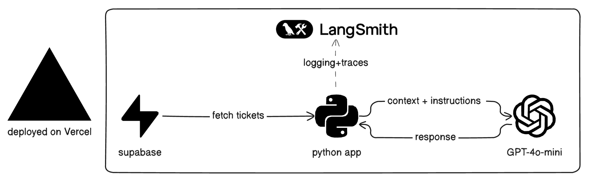
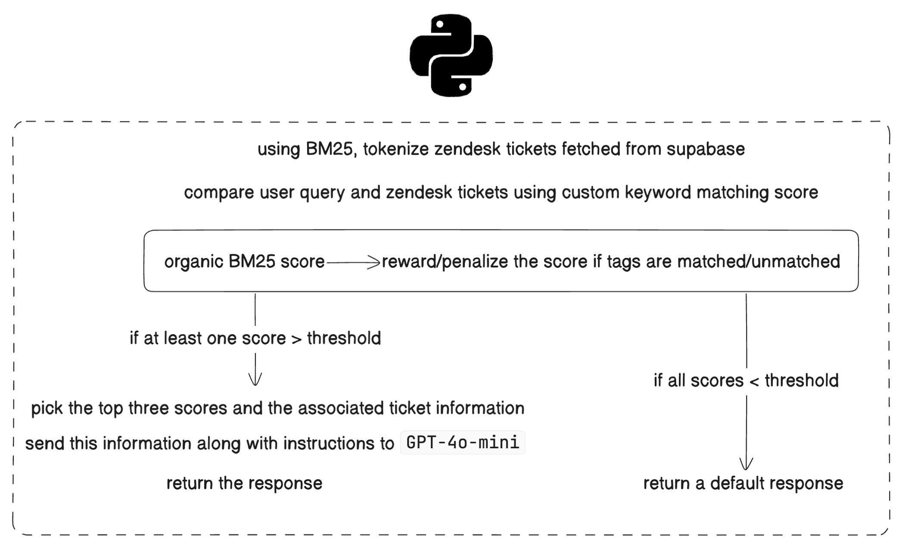

# Ravenna Chat API

This private project implements a chatbot API that uses BM25 search to find relevant support tickets and OpenAI's GPT-4o-mini to generate human-like responses. It's designed to assist customer support agents by providing AI-generated responses based on existing support ticket data.

## Time Spent

- 3.5 hours: Setting up the project, implementing the BM25 search algorithm and the API, setting up Supabase and deploying the app to Vercel.
- 40 minutes: Writing the README and documentation.

## Deployed Endpoint

[https://ravenna-chat.vercel.app/chat](https://ravenna-chat.vercel.app/chat)

To make a request, send a `POST` request to the `/chat` endpoint with a JSON payload:

```json
{
  "question": "How do I reset my password?"
}
```

You get a response like this:

```json
{
  "response": "To reset your password, please follow these steps..."
}
```

## Architecture

The application consists of the following main components:



1. Python App: FastAPI-based application that handles HTTP requests and orchestrates the chatbot logic.
2. Supabase: Database for storing and retrieving support tickets.
3. LangSmith: Used for traceability and debugging.
4. OpenAI's `GPT-4o-mini`: Used for generating responses.
5. Vercel: Used for hosting the API.

## Functionality



## Features

- `BM25` search for finding relevant support tickets
- Integration with OpenAI's `GPT-4o-mini` for generating responses
- Tag-based scoring to improve search relevance
- Configurable relevance threshold for determining when to use AI-generated responses
- FastAPI for high-performance API endpoints
- Comprehensive test suite using `pytest`

## Trade-offs


- I chose BM25 over other search algorithms (like vector search or hybrid approaches) because it was the most performant and easy to implement, given the time constraint.
- I chose Supabase over a more traditional database like Postgres because of its ease of use and the fact that it provides a Postgres-compatible database out of the box, allowing me to focus on the chatbot logic rather than setting up and managing a database.
- I chose `GPT-4o-mini` over other models because of low latency and cost.

## Assumptions

- The support tickets are stored in a table called `zendesk` in Supabase.
- The `zendesk` table has the following columns: `ticket_id`, `customer_question`, `support_agent_response` and `tags`.
- The `tags` column is an array/collection of strings associated with the ticket.

## Scaling to Production

- Loading the tickets from Supabase to the app needs to be done on startup of the app, instead of doing it on every request.
- Use a load balancer to scale the app horizontally.
- The app could be ideally deployed to a cloud service provider. I chose Vercel because it provides a free tier and is easy to use.

## Prerequisites

- Python 3.8+
- pip (Python package manager)

## Installation

1. Clone the repository:
   ```
   git clone https://github.com/yashwantreddy/ravenna-chat.git
   cd ravenna-chat
   ```

2. Create a virtual environment using `conda`:
   ```
   conda create -n ravenna-chat python=3.12
   conda activate ravenna-chat
   ```

3. Install the required packages:
   ```
   pip install -r requirements.txt
   ```

4. Set up environment variables:
   Create a `.env` file in the project root and add your OpenAI API key (for generating responses), Supabase URL, and Supabase Key (to fetch zendesk tickets):
   ```
   OPENAI_API_KEY=your_api_key_here
   SUPABASE_URL=your_supabase_url_here
   SUPABASE_KEY=your_supabase_key_here
   ```

## Usage

1. Start the FastAPI server:
   ```
   uvicorn app.main:app --reload
   ```

2. The API will be available at `http://localhost:8000`. You can access the interactive API documentation at `http://localhost:8000/docs`.

3. To use the chatbot, send a POST request to the `/chat` endpoint with a JSON payload:
   ```json
   {
     "question": "How do I reset my password?"
   }
   ```

4. The API will respond with a JSON object containing the generated response:
   ```json
   {
     "response": "To reset your password, please follow these steps..."
   }
   ```

## Configuration

You can adjust the BM25 search parameters in `app/main.py`:

```python
bm25_searcher = BM25Searcher(threshold=7.0, tag_boost=2.0)
```

- `threshold`: Minimum relevance score for a ticket to be considered
- `tag_boost`: Score boost applied for matching tags

## Testing

Run the test suite using pytest:

```
pytest
```
